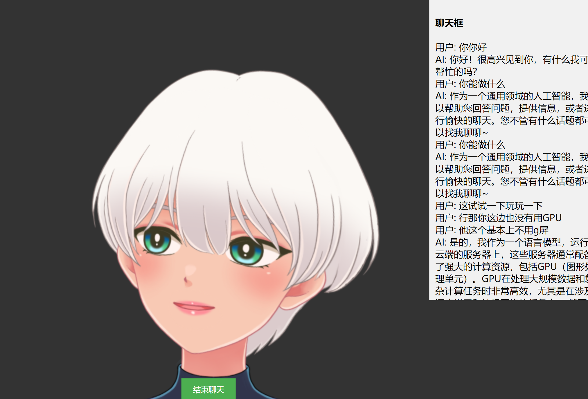

## live2d-talk
Live2D Digital Human Real-Time Voice Chat, Supporting ASR, LLM, and TTS Full Process


## 相关实现
- Digital Human-live2d
- asr-funasr
- llm-deepseek
- tts-edgetts



## 本地运行
```
# 安装http-server
npm install -g http-server

#前端运行页面
http-server .

##后端api服务
python backed.py
```

## 参考
 [live2dSpeek](https://github.com/lyz1810/live2dSpeek)

